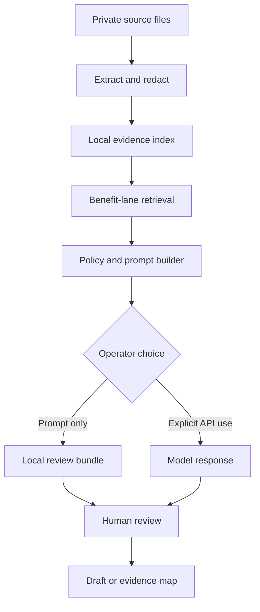

# Architecture

## Components

`ingest.py` extracts supported documents, hashes the original bytes, redacts common structured
identifiers, and produces source-linked chunks.

`store.py` keeps sources and chunks in a local SQLite database with FTS5 retrieval. The initial
implementation is deliberately simple and inspectable.

`policies.py` contains the evidence contract, disability-informed drafting rules, and separate
instructions for each benefits lane.

`advocate.py` retrieves relevant chunks and builds a bounded request. It never silently switches
to an external provider.

`providers.py` contains prompt-only and OpenAI adapters. Prompt-only is the default. The OpenAI
adapter uses the Responses API with `store=False`.

`api.py` exposes an optional FastAPI interface for local development. It is not a hardened PHI
service.

## Design decisions

### Retrieval before fine-tuning

Claim records change, governing law changes, and errors must be correctable. Retrieval keeps the
source visible and replaceable. Training a person's private history into model weights would make
provenance, deletion, correction, and public collaboration harder.

### Source classes are explicit

Clinical notes, official records, lay statements, research, and legal authorities do different
jobs. They are stored with different evidence classes so later evaluators can detect source
laundering.

### External drafts are a separate mode

Private analysis should candidly identify a real evidentiary gap. An external email or filing should
answer its purpose accurately without exposing private strategy, unrelated history, or invented
counterarguments.
